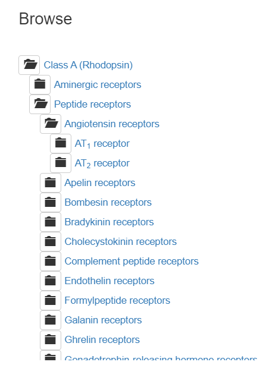

# AT1
Исследование связи AT1 и бета-аррестина

## Основные направления
1. Обзор литературы
   1. Что такое GPCR, какие бывают 
      
   2. Что такое AT1:
      2. Что узнает 
      3. Где экспрессируется?
      4. Что происходит на уровне тканей/органов/органных систем 
      5. Какие болезни с ним связаны 
      6. Какие лекарства 
      7. Структуры 

   3. Интернализация рецепторов:
      1. Как происходит, какие белки участвуют, зависит от лиганда/не зависит 
      2. Значение с точки зрения физиологии
      3. Значение с точки зрения фармакологии (с примерами);  biased-агонисты 
   4. Аррестины
      1. Что такое аррестины? Какие бывают?
      2. Что узнает 
      3. Где экспрессируется?
      4. Что происходит на уровне тканей/органов/органных систем 
      5. Какие болезни с ним связаны 
      6. Какие лекарства 
      7. Структуры 
2. Работа с моделями 
   1. Модели с аррестинами из pdb: https://gpcrdb.org/structure/
      1. ⚠ Обновления не мгновенные, новые структуры могут быть не указаны 
   2. Структуры AT1
      1. Идентификация остатков рецептора и аррестина:
         1. По BW
         2. По наложению
   3. Результаты: остатки в папке seq, картинки в папке images, pml-скрипт(ы) в папке scripts

Примечания к оформлению:
1. Ссылки в формате:[Фамилия, год](Https://doi)
2. язык верстки - Markdown