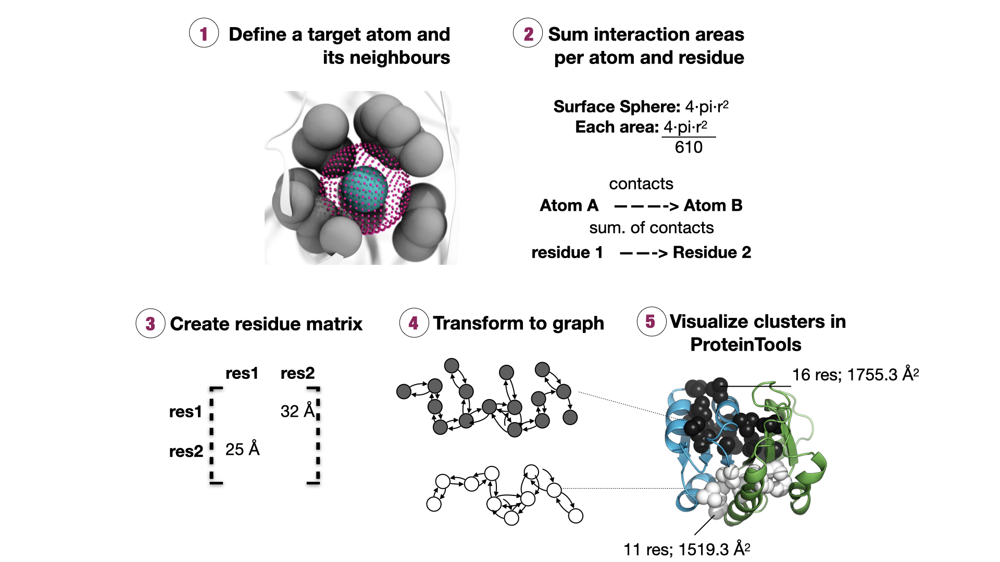

# Структура названий изображений кластеров контактов

{BW}\_{AT1_code}\_{arr_code}\_{cluster}

BW - номер остатка gpcr по номенклатуре BW(Ballesteros Weinstein)

AT1_code - код pdb модели AT1

arr_code - код pdb модели gpcr с аррестином

cluster - номер кластера, для гидрофобных кластеров параметры находятся в [Hydrophobic_clusters.csv](../../data/Hydrophobic_clusters.csv)

Для остатков GPCR на изображениях еще указан BW. Зеленый цвет спиралей соответствует GPCR, а розовый аррестинам.

### Цвета связей

Связи обозначены пунктирной линией и подписаны расстоянием.

Цвета промаркированы в соответствии с типом связи:

1. красный - акцепторно-акцепторной или донорно-донорное отталкивание
2. фиолетовый - слабая донорно-акцепторная связь
3. желтый - сильная донорно-акцепторная связь

# Типы связей
## HY - водородная связь

Расстояние между N, O, S, Se в диапазоне от 2 до 3.6 Å
Расстояния вычислены по теореме косинусов с учетом расстояний связей:

1. O-H 0.97 Å
2. O--H 2.04 Å
3. S-H 1.35 Å
4. N-H 1.01 Å
5. S-S 2.05 Å
6. O--O через H 2.50 Å
7. O--N через H 3.05 Å - самая частая связь

## RE - стерическое отталкивание

Расстояние между атомами кроме H меньше 2Å.

## IO - ионная связь

Заряженный азот и кислород на концах заряженных аминокислот.

## PH - гидрофобная связь

Боковые цепи изолейцина, лейцина и валина часто образуют гидрофобные кластеры. 
Гидрофобные кластеры вычислены по методу [CSU](https://proteintools.uni-bayreuth.de/clusters/documentation): 

На рисунке выше показан алгоритм, который работает следующим образом: два атома A и B считаются контактирующими, если молекула растворителя, помещенная на поверхность сферы A, перекрывается со сферой, образованной молекулой растворителя, и сферой Ван-дер-Ваальса атома В.
Атомы считаются сферами фиксированного радиуса.
Если в каком-либо положении молекула воды проникает в несколько атомных сфер, контактом считается та, чей центр находится ближе всего к центру атома А.
Каждый атом разбивается на множество однородных мелких участков сеткой Фибоначчи, где сфера каждого атома разбита на 610 секций.
Площадь соответствует 0.0016 от общей площади сферы.
Затем алгоритм оценивает, перекрывается ли какая-либо из 610 секций с соседями, и если да, то контакт в секции объявляется принадлежащим сфере, центр которой находится ближе всего к центру этого атома.
Алгоритм выполняется для всех атомов до тех пор, пока не будет вычислена матрица площадей каждой пары остатков.
Два остатка находятся в контакте, когда их площадь перекрытия составляет не менее 10 $Å^2$.
Смежная матрица преобразуется в граф, где каждый компонент соответствует (гидрофобному) кластеру.
Общая площадь кластера вычисляется как сумма отдельных площадей остатков, которые его составляют.
